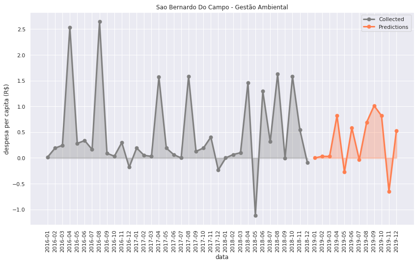
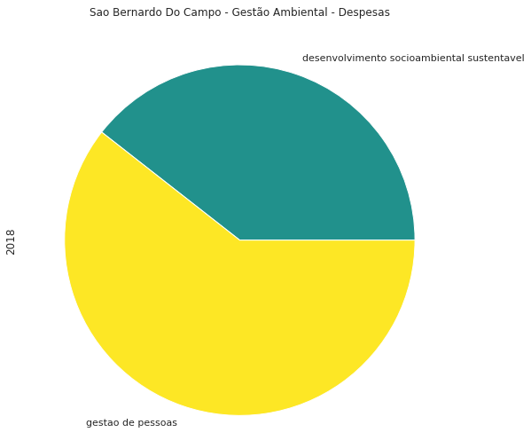
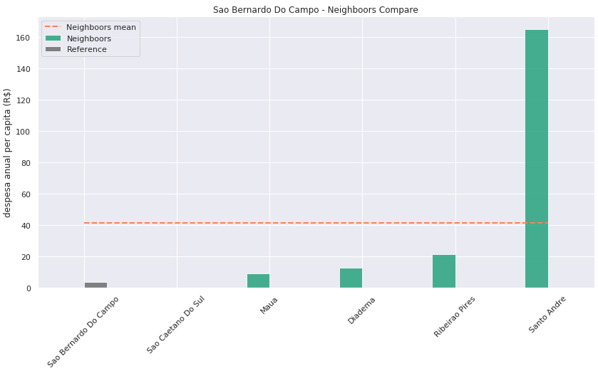
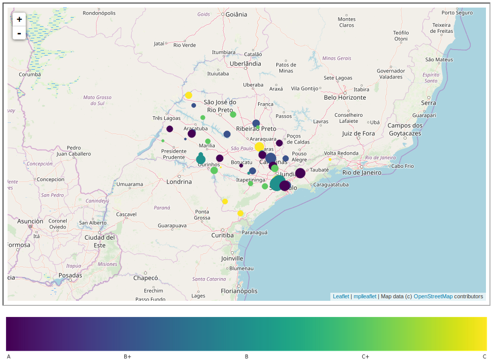

# deephack

### Autores: 
## Lucas Nunes Sequeira, Guilherme Duarte Laurindo de Souza e Ian Lucas Ramos de Carvalho dos Santos Pinto

### Data: 16/10/2019

Automatização da coleta de dados das despesas em 'Gestão Ambiental' para os municípios cobertos pelo Tribunal de Contas do Estado de São Paulo (TCE-SP). *Insights* em análises de dados com visualizações gráficas em séries temporaris, tabelas, pizzas e mapas.

#### Automatização da coleta de dados
Com um comando o usuário consegue coletar as informações das despesas em 'Gestao Ambiental' de um município de interesse para um intervalo de anos; com isso todas as visualizações supracitadas estão disponíveis. Além disso, existe a opção de coletar as informações dos k-vizinhos do município com base nas latitudes e longitudes para análises locais. Não só isso, como também é possível automaticamente treinar uma rede recorrente (RNN simples) para predição do comportamento futuro do município em questão.
```
    referencia = readMunicipio('São Bernardo do Camplo', years = (2016, 2018), k_neighboors=5, trainRNN = True)
```
#### Visualização dos dados
Coletada as informações de um dado município, podem ser feitas visualizações como:
- **Séries temporais:** Representam os gastos *per capita*, referentes à Gestão Ambiental, para cada mês; e se for feita a opção para o treino automático da RNN, fica também visível a predição futura em um ano para o município em análise.

```
    referencia.plotSerie()
```
<div style="text-align:center"></div>

- **Pizza de descrição:** Já nessa representação, a fins de interesse de explicabilidade sobre quais programas foram distribuidas as despesas anuais, podemos visualizar em um gráfico de pizza tal distribuição dada uma lista de anos.

```
    referencia.plotOverview([2018])
```



- **Comparação de despesas locais:** Nessa representação, visualizamos em destaque a despesa *per capita* total para o ano predito do município de referência, em comparação com o último gasto anual dos k-vizinhos da referência.

```
    referencia.plotNeighboorsCompare()
```



#### Visualização no mapa dos municípios + indicações
Com um único comando, para uma dada lista de municípios (opcional, caso nao passado, são lidos todos os municípios) fica dispinével uma base para ser interpretada no mapa mundi com a respectiva visualização dos indicadores de <a href='https://iegm.tce.sp.gov.br/help.html'>i-Amb</a> e o tamanho relativo á magnitude de diferença entre as despesas em Gestão Ambiental anuais previstas do município referência com relação ao último ano dos seus vizinhos. A escolha da comparação com os vizinhos foi pensada para manutenção de características geográficas comuns entre os municípios comparados.

*obs. Caso queira navegar pelo mapa a baixo, acesse o arquivo '_map.html' na pasta principal deste repositório*

``` 
    # para o exemplo usamos os municípios listados em 'datasets/municipios_sample.csv'
    plotMapMun(names_municipios = lista_nomes_municipios)
    mplleaflet.display()
```




Dependências:
------------

- pandas=0.25.0
- seaborn=0.9.0
- matplotlib=3.1.0
- numpy=1.16.4
- tensorflow=1.14.0
- progressbar=3.37.1
- pickle
- mplleaflet
- unicode
- zipfile
- urllib
- os

Parceria:
---------


